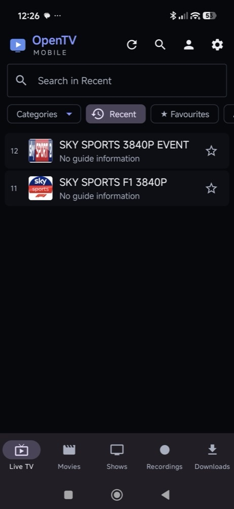
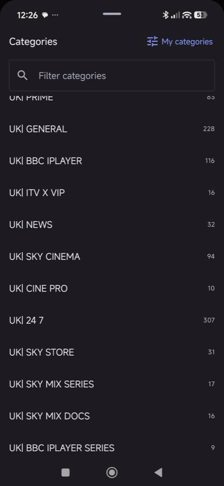
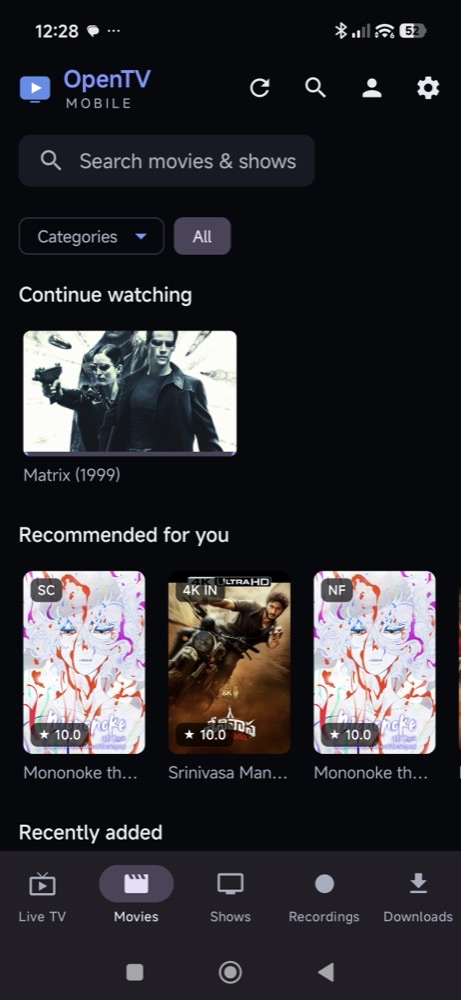
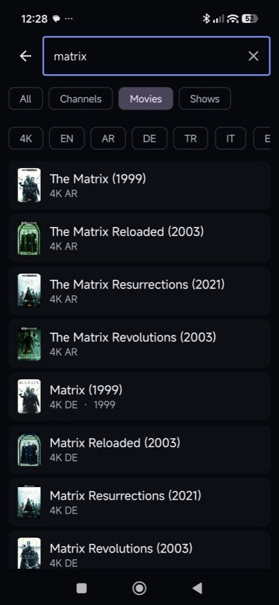
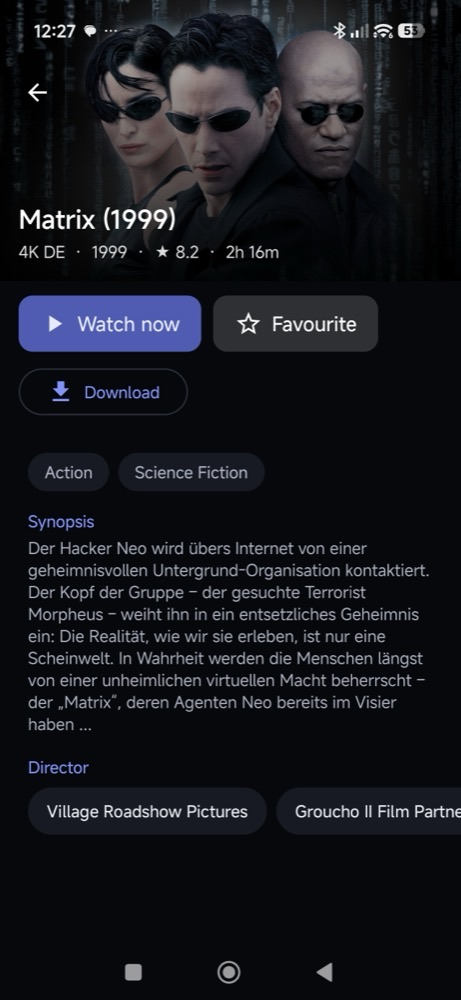
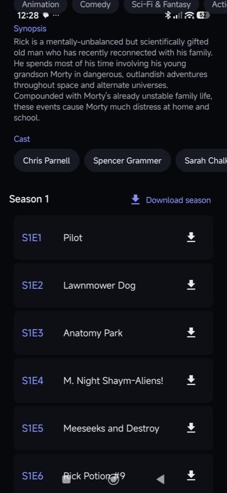
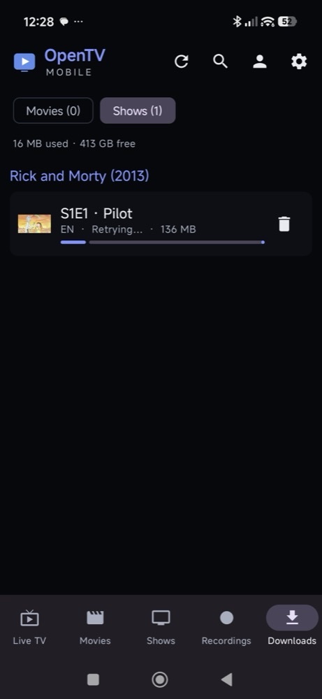
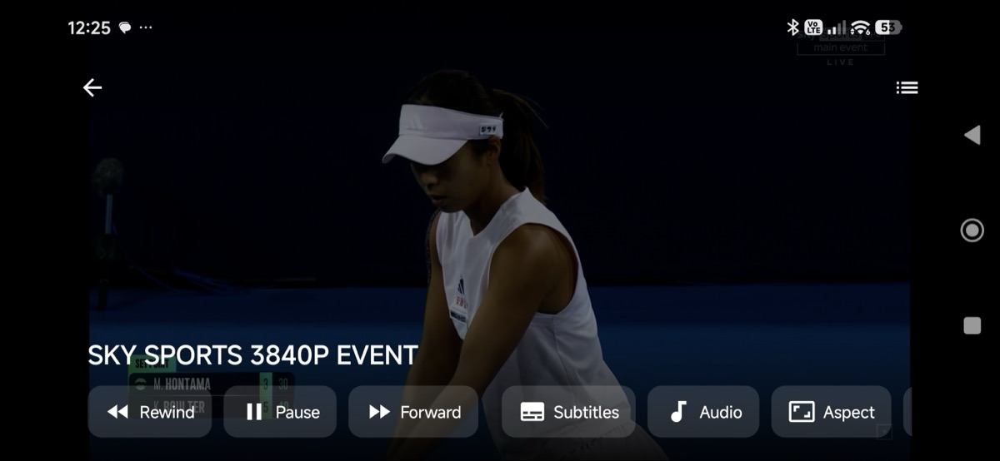

<p align="center">
  
</p>

<p align="center">
  <b>A free, open-source IPTV player built for Android phones.</b><br>
  Portrait browsing · touch controls · offline downloads · instant search over huge catalogues
</p>

<p align="center">
  <a href="https://github.com/opentv-mobile/opentv-mobile/releases/latest"></a>
  <a href="LICENSE"></a>
  
</p>

No account. No subscription. No server of ours between you and your provider.

> **Built on [OpenTV](https://github.com/opentvproject/opentv)** by the OpenTV contributors — a
> d-pad-first player for Android TV. OpenTV Mobile started as a fork of it and reworks the app
> around phones. See [Credits](#credits).

## Screenshots

<p align="center">
  
  
  
  
</p>
<p align="center">
  
  
  
</p>
<p align="center">
  
</p>

## Features

**Live TV**
- Xtream Codes, M3U/M3U8 playlists and Stalker portals
- Search inside the current category, or across every channel
- Category sheet with its own filter and a channel count per category
- **My categories** — keep only the groups you care about (e.g. just `ES|`)
- Country-aware categories: `ES| Sports` and `DE| Sports` stay apart
- **Recent** channels, favourites, sort by provider order / A–Z / number
- Programme guide (XMLTV) with now/next on every channel

**Player**
- Portrait browsing, landscape playback, true full screen
- Swipe left/right to change channel (or skip in films), drag for brightness and volume
- Picture-in-picture, audio/subtitle tracks, aspect ratio, external player hand-off

**Films & series**
- Origin tags on titles (`ES`, `EN 4K`, `NF`…) with one-tap filters — pick your language out of
  "a thousand Matrixes"
- Clean titles, three-column grids, per-tab **Continue watching**
- Instant full-text search over 180k+ titles, recent searches

**Downloads**
- Save films and episodes for offline viewing (planes, trains, no signal)
- Queued one at a time, so single-connection providers don't refuse them
- Plays from the file, resumes where you left off

**Also from OpenTV**
- Recording (DVR) to the phone, USB or a NAS, catch-up where your provider offers it, reminders
- Profiles, parental PIN, device-to-device sync with no server
- Translated into many languages (fully in Spanish)

On Android TV and Google TV the app keeps OpenTV's d-pad interface.

## Install

1. Download the APK from **[Releases](https://github.com/opentv-mobile/opentv-mobile/releases/latest)**.
2. Open it on your phone and allow installs from that source when Android asks.
3. Add your provider — OpenTV Mobile is a player; it doesn't supply any channels.

It installs as its own app, alongside OpenTV if you have it. New versions are offered inside the
app (Settings → About).

## Privacy

- **No servers of ours, no account, no analytics.** Your provider details stay on your device.
- Sync between your own devices happens directly (or through your own NAS), never through a
  machine we run. See [docs/PRIVACY.md](docs/PRIVACY.md) and
  [docs/ARCHITECTURE.md](docs/ARCHITECTURE.md).

## Build it yourself

```bash
git clone https://github.com/opentv-mobile/opentv-mobile.git
cd opentv-mobile
./gradlew assembleDebug      # APK in app/build/outputs/apk/debug/
./gradlew test               # unit tests
```

You need JDK 17+ and the Android SDK (API 35); Android Studio fetches it for you.

## Contributing

Bug reports and pull requests are welcome — see [CONTRIBUTING.md](CONTRIBUTING.md). Most IPTV
bugs are provider- or device-specific, so a report that says which provider type (Xtream, M3U,
Stalker) and which phone is worth a lot. [Open an issue](https://github.com/opentv-mobile/opentv-mobile/issues/new/choose).

## Support

OpenTV Mobile is free and always will be — nothing is gated behind a payment.

<!-- MAINTAINER_SUPPORT: donation link for OpenTV Mobile's own development goes here. -->

If it's useful to you, please also consider supporting **the original OpenTV authors**, whose
work this app is built on: [GitHub Sponsors](https://github.com/sponsors/legionnaireneyland) ·
[PayPal](https://www.paypal.com/donate/?business=leetobin1982@gmail.com&item_name=Support+OpenTV&no_recurring=0&currency_code=GBP)

## Credits

OpenTV Mobile is a derivative of **[OpenTV](https://github.com/opentvproject/opentv)**, written by
the OpenTV contributors and licensed GPL-3.0-or-later. OpenTV's full commit history is preserved
in this repository and every file keeps its original copyright notice; changes made here are
© the OpenTV Mobile contributors under the same licence.

Like OpenTV, it was written with **Claude**, Anthropic's AI assistant, working from a human's
direction. OpenTV was built clean-room from public specifications (Xtream Codes, XMLTV, M3U) —
nothing decompiled or copied from any existing IPTV app — and this project keeps to that.

## Licence

[GPL-3.0-or-later](LICENSE). Anyone can take this code, but if they ship it they must ship their
source too.

## Legal

OpenTV Mobile is a media player, comparable to VLC. It ships with no channels, no playlists and
no links to any. What you point it at, and whether you are entitled to, is between you and your
provider.
